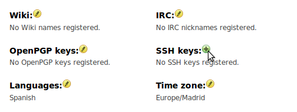
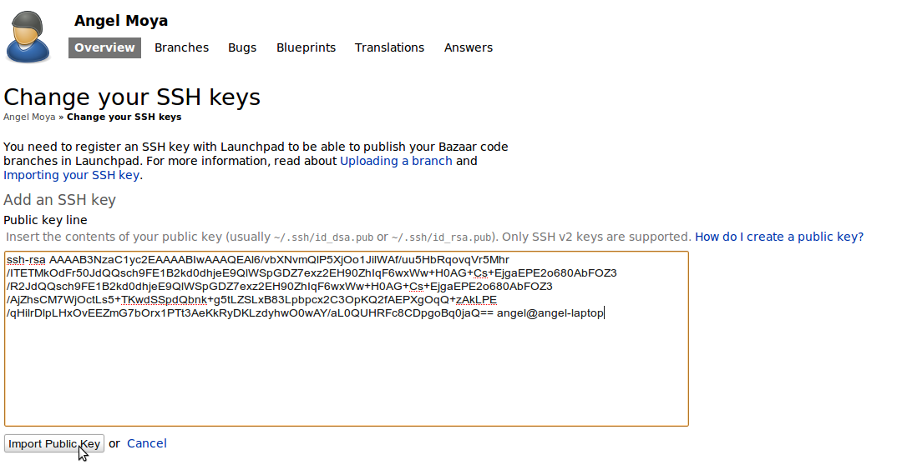

=========================================
Bazaar - Sistema de gestión de versiones.
=========================================

Es un sistema de control de versiones distribuido con el objetivo de facilitar que varias personas puedan trabajar de forma conjunta en proyectos de software.

Permite montar archivos bajo el control de versiones, es decir, registrar cambios en ellos, examinar su trabajo, publicarlo y enviar su trabajo para que sea integrado en el trunk de un proyecto.

Instalación.
============
    
Lo instalas como cualquier paquete en Ubuntu::

    $sudo apt-get install bzr

Preséntese.
===========

Antes de empezar a trabajar, es conveniente que le diga a Bazaar quién es usted. De ese modo su trabajo será identificando correctamente en los logs de revisión.

Utilice su nombre y dirección de email en lugar de John Doe, teclee::

    $bzr whoami "John Doe <john.doe@gmail.com>"

Bazaar creará o modificará ahora un archivo de configuración, incluyendo su nombre y dirección de email.

Ahora compruebe que su nombre y dirección de email se han registrado correctamente::

    $bzr whoami
    >> John Doe <john.doe@gmail.com>

Ponga archivos bajo control de versiones.
=========================================

Vamos a crear un directorio y algunos archivos para utilizar con Bazaar::

    $mkdir miproyecto
    $cd miproyecto
    $mkdir images
    $touch hola.py calculo.py images/lista.txt

Ahora haremos que Bazaar se inicialize en el directorio de su proyecto::

    $bzr init
    >> Creado un standalone tree (formaot: 2a)

Si parece que no ha ocurrido nada no se preocupe. Bazaar ha creado un branch donde guardará sus archivos y su histórico de revisiones.

El siguiente paso es decirle a Bazaar a que archivos desea seguirles la pista. Ejecutando *bzr add* agregará recursivamente todos los elementos dentro del proyecto::

    $bzr add
    >> adding calculo.py
    >> adding hola.py
    >> adding images
    >> adding images/lista.txt

A continuación haga un *commit*  de los archivos agregados a su branch. Incluye un mensaje para explicar porque se realiza el *commit*::

   $bzr commit -m "Importación inicial"
   >> Committing to: /home/yani/Escritorio/miproyecto/
   >> añadido calculo.py
   >> añadido hola.py
   >> añadido images
   >> añadido images/lista.txt
   >> Committed revision 1.

Como Bazaar es un sistema de control de versiones distribuido, no necesita conectar con un servidor central para hacer el commit. Bazaar guarda su branch y todos sus commits dentro del directorio con el que está trabajando, busque el subdirectorio .bzr.

Haciendo cambios en sus archivos.
=================================

Vamos a cambiar un archivo e introduciremos ese cambio en su branch.
Edite *hola.py* en su editor favorito y luego compruebe que ha hecho::

    $bzr diff
    >> === modified file 'hola.py'
    >> --- hola.py     2013-01-14 16:03:54 +0000
    >> +++ hola.py     2013-01-14 16:11:11 +0000
    >> @@ -0,0 +1,1 @@
    >> +print "Hola Mundo"

Añada su trabajo al branch de Bazaar::

    $bzr ci -m "Añadida la primera línea de texto"
    >> Committing to: /home/yani/Escritorio/miproyecto/
    >> modificado hola.py
    >> Committed revision 2.

Un vistazo el log de revisiones.
================================

Consultar el log de revisiones::

    $bzr log
    >> revno: 2
    >> committer: Yanina Aular <yanina.aular@vauxoo.com>*
    >> branch nick: miproyecto*
    >> timestamp: Mon 2013-01-14 11:42:29 -0530*
    >> message:*
    >> Añadida la primera línea de texto*
    >> revno: 1*
    >> committer: Yanina Aular <yanina.aular@vauxoo.com>*
    >> branch nick: miproyecto*
    >> timestamp: Mon 2013-01-14 11:33:54 -0530*
    >> message:
    >> Importacion inicial

Launchpad.
==========

Launchpad es una suite de herramientas de desarrollo y hosting para proyectos de software libre. Puede utilizarlo para publicar su branch.

Si no dispone de una cuenta de Launchpad, siga la guía de registro de cuentas y registre una clave SSH en su nueva cuenta de Launchpad.

Crear cuenta en Launchpad.
==========================

https://help.launchpad.net/CreatingYourLaunchpadAccount

Registrar clave SSH en la cuenta de Launchpad.
==============================================

Instala OpenSSH::

    $sudo apt-get install openssh-client

Genera la clave::

    $ssh-keygen -t rsa

- Presiona intro para aceptar el nombre por defecto

- Introduce la contraseña

Con esto se genera en el directorio /home/usuario/.ssh/ una pareja de claves, \
id_rsa la clave privada y id_rsa.pub la clave pública. La clave privada se \
quedará en tu equipo y la pública hay que subirla a tu perfil de launchpad. \
Logeate en www.launchpad.net con tu usuario y accede a tu página para \
editar la información de SSH keys.

Copia en esa ventana la información que hay dentro del fichero /home/usuario/.ssh/id_rsa.pub y haz click en el botón Import Public Key para terminar.

Publicando su branch con Launchpad.
=================================================================

Launchpad es una suite de herramientas de desarrollo y hosting para proyectos de software libre. Puede utilizarlo para publicar su branch.::

    $bzr push lp:~usuario-creado/+junk/miproyecto

.. note:: +junk significa que este branch no está asociado con ningún proyecto concreto en Launchpad.

También puede ver información sobre su branch, histórico de revisiones incluido, en https://code.launchpad.net/~usuario-creado/+junk/miproyecto

Creando su propia copia de otro branch
====================================================================

Ahora cualquiera podrá crear su propia copia de su branch tecleando::

    $bzr branch lp:~usuario-creado/+junk/miproyecto

Para trabajar con el código de otra persona, tendrá que \
hacer su propia copia de su branch. Vamos a coger un \
ejemplo real, la interfaz GTK de Bazaar::

    $bzr branch http://bazaar.launchpad.net/~bzr/bzr-gtk/trunk bzr-gtk.john
    >> Branched 292 revision(s).

Bazaar descargará todos los archivos y el histórico de revisiones completo del trunk branch del proyecto bzr-gtk y creará una copia llamada bzr-gtk.john.

Ahora dispone de su propia copia del branch y puede enviar cambios con o sin \
una conexión de red. Puede compartir su branch en cualquier momento \
publicándolo, y si el equipo de bzr-gtk desea utilizar su trabajo, Bazaar \
les facilita integrar su branch dentro de su trunk.

Comandos.
==========

- **bzr add o bzr add [FILE..]**: Adiciona el archivo o directorio.

- **bzr revert o bzr revert [FILE..]**: Deshace todos los cambios en el archivo especificado y devuelve al estado en que estaba después de la última actualización.

- **bzr annotate [FILE..]**: Ver el origen de cada línea en el archivo especificado.

- **bzr revno o bzr revno[FILE..]**: Número de revisiones del branch.

- **bzr log**
 
	**bzr log -r x** 

	**bzr log -r x..y** (siempre y cuando x < y y sean números enteros)

	**bzr log [FILE..]**: Ver los cambios hechos en las revisiones o archivos señalados.

- **bzr push o bzr push [LOCATION]**: Actualiza un espejo de este branch, es decir, los cambios hechos localmente se actualizan en la nube de la localización especificada. 

- **bzr pull o bzr pull [LOCATION]**: Activo este branch en un espejo de otro branch, es decir, actualizo los cambios o revisiones de la nube a mi branch local.

- **bzr diff**: Mostrar todos los cambios no confirmados

- **bzr diff -r X**: Mostrar todos los cambios no confirmados desde la revision X

- **bzr merge [FROMLOCATION] or bzr merge [FROMLOCATION] [TOLOCATION]**: Fusiona dos branches.

- **bzr rm [FILE..]**: Borra el archivo del branch

- **bzr mv [FILE..] [LOCATION..]**: Mover un archivo dentro del branch

- **bzr mkdir**: Crear un directorio en el branch

- **bzr uncommit**: Permite devolver la confirmación de un cambio.

- **bzr uncommit -r x**: Si quiero revertir los cambios que he hecho hasta ahora en la revision x

- **bzr launchpad-login usuario-creado**: Si usted tiene una cuenta en Launchpad y quieren confirmar los cambios allí, es necesario especificar el nombre de usuario de Launchpad.

- **bzr status o bzr stat**: Ver el estado del branch, tiene archivos agregados, modificados o borrados sin confirmar.

Crear un grupo en launchpad.
============================

Utilice un equipo para agrupar personas involucradas en una tarea en común. Por ejemplo, un equipo puede ser el responsable de un proyecto o el editor de un paquete para un idioma en particular.

Crear un proyecto en launchpad.
===============================

Los proyectos en launchpad son compartidos por todas las comunidades para fomentar la colaboración entre los desarrolladores, traductores, empacadores, y otros colaboradores.

Crear blueprints.
=================

Al crear un proyecto, se puede agregar blueprints.

Un blueprint es una simple especificación. En él se describe una idea - como función o proceso -  y rastrea metadatos suficientes para mostrar su estado de ejecución y quién está involucrado.

Echemos un vistazo a la información que constituye un blueprint:

- Título y resumen: algunas ideas son lo suficientemente simples para expresarlas plenamente en el resumen.

- Los elementos de trabajo: los pasos necesarios para completar el trabajo del blueprint, junto con el estado de cada paso.

- Enlace a la información: esto puede ser cualquier URL y suele ser una página wiki donde está plenamente la idea o característica explorada. Launchpad no proporciona una instalación wiki.

- La gente: ¿quién está trabajando en este proyecto? Si lo desea, puede realizar un seguimiento de la persona redacción del anteproyecto, el cesionario y el revisor.

- Redacción de estado: ¿Se ha discutido bien esto? ¿Sigue siendo sólo una idea o está listo para código?.

- Estado de la implementación.

- Errores relacionados: enlace a los informes de errores seguidos en Launchpad que pueden solucionarse o que son afectados por esta función.

- Ramas Código: mientras que usted está trabajando en la implementación, puede cargar / registrar sus ramas de código de Launchpad y enlace a los mismos desde el blueprint.

- Suscriptores: la gente puede suscribirse para recibir alertas cuando cambia el blueprint.

- Dependencias: Blueprints implementados antes de éste.

Reportar bug.
=============

Ir al link del proyecto. Por ejemplo: https://launchpad.net/openerp-venezuela-localization.

Buscar la opción de reportar Bug.

Proponer merge.
===============

Ir al branch relacionado con el proyecto, por ejemplo: https://code.launchpad.net/~openerp-venezuela/openerp-venezuela-localization/6.1

Buscar la opción Propose for merging

